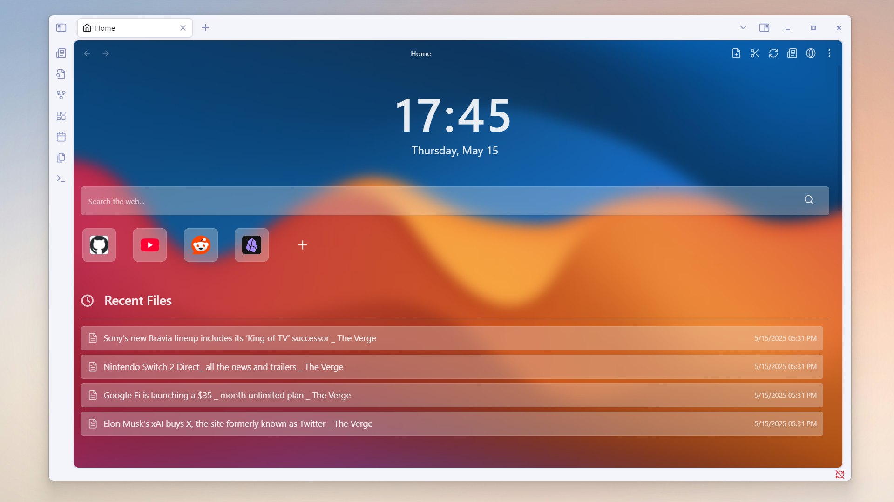
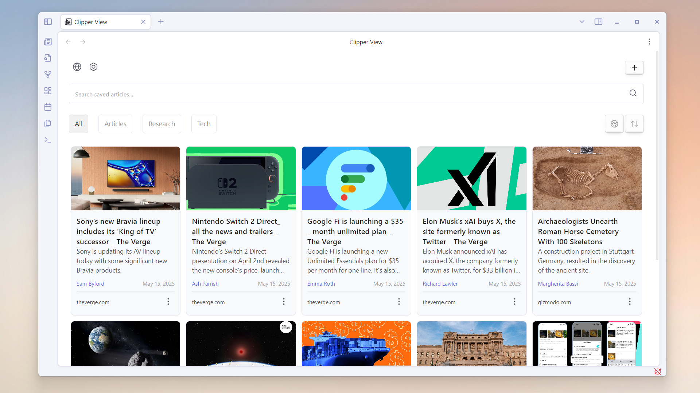

## NetClip

NetClip is an Obsidian plugin that lets you browse the web and clip webpages directly into your vault. It also offers organized category management for better content organization.

  
### Demo

  

---

  

---

### Features

- **Web Clipping**: Save web articles (title, content, metadata) as Markdown files.
- **Content Organization**: Organize clipped content into folders/categories.
- **Metadata Extraction**: Includes author, thumbnail, publication date, reading time
- **Webview**: browse pages within Obsidian.
- **Search & Filter**: Search clipped content and filter by categories.
- **Search Suggestions**: Auto-complete for search queries
- **AI Processing**: Transform and analyze content using Google's Gemini AI

### AI Processing Features

- **Custom AI Prompts**: Create and customize prompts to process your clipped content
- **Variable Support**: Define variables in your prompts for flexible content processing
- **Real-time Progress**: Watch as your content is processed with a sleek progress UI
  
To use AI features:

1. Get a Gemini API key from [Get API key | Google AI Studio](https://aistudio.google.com/apikey)
2. Enable AI processing in plugin settings
3. Add your [API key](https://aistudio.google.com/apikey)
4. Create custom prompts or use the default ones 
5. Select prompts when clipping content

### How to Clip a Webpage

1. Open the **Clipper View** by clicking the plugin's icon in your sidebar.
2. Click the **plus (+) button** at the top right.
3. The URL will automatically be pasted into the input field.
4. select a **category** for the clip (Optional).
5. Click **Clip** to save the content into your vault.
6. 
### Webview Clipping

In Webview mode, there are two buttons available:

- **Quick Save**: Save the webpage instantly to your vault.
- **Open Modal**: Opens a modal for selecting a category before saving.

### Available Commands

- **Open NetClip View**: Launches the main NetClip interface to view all saved pages.
- **Open Web in Editor**: Opens a webview in the workspace with the default URL.
- **Open Web Modal**: Opens a modal webview with the default URL.
- **Open Modal Clipper**: Opens a modal for clipping a webpage.

### Managing Categories

1. Create new categories via the plugin settings.
2. Modify or delete existing categories as needed.
3. Filter saved content by selecting the appropriate category tab.

### Installation

#### Community Plugins

1. Open Obsidian and navigate to **Settings** > **Community Plugins**.
2. Search for **NetClip** in the community plugins directory.
3. Click **Install** and enable the plugin.
4. Customize your preferences under the **NetClip** settings tab.

  

#### Install via BRAT

1. Install [BRAT](https://tfthacker.com/brat-quick-guide#Adding+a+beta+plugin) from Obsidian's Community Plugins.
2. Open the **BRAT** command form and type:  
   ``BRAT: Add a beta plugin for testing``
3. Enter the link:  
   `https://github.com/Elhary/Obsidian-NetClip`
4. After adding the plugin, you will see it in your ribbon or plugin list.

### Support

If you'd like to support the plugin's development, feel free to donate!  Every little bit helps.

  
- [Ko-fi](https://ko-fi.com/elharis)
- [Buy Me a Coffee](https://buymeacoffee.com/el_haris)

### License
This plugin is licensed under the [MIT](https://mit-license.org) License.
