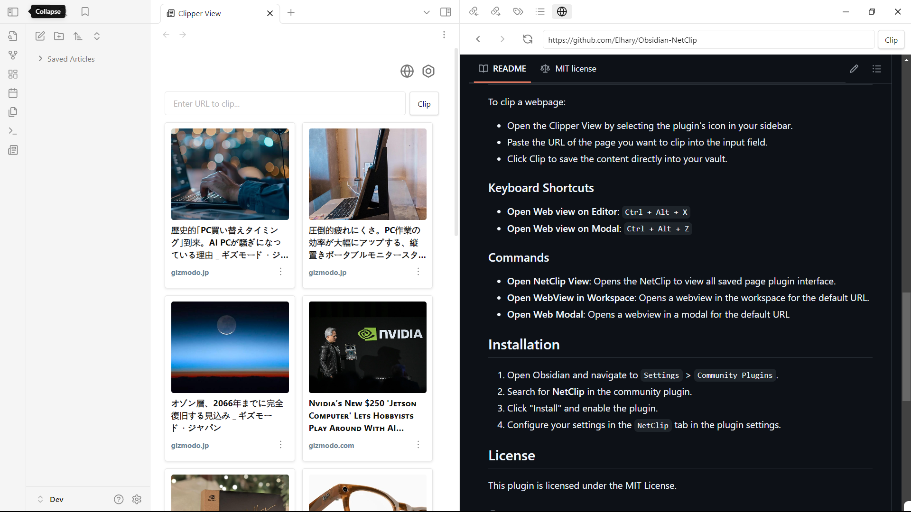

## NetClip Plugin for Obsidian

this plugin is for Obsidian that allows you to browse the web and clip webpages directly into your vault.

## Features

- Save articles or webpages directly into your vault as Markdown files.
- Extract essential metadata like titles, descriptions, publish dates
- Automatically clip images and thumbnails for enhanced organization
- Browse Webpages within Obsidian: View webpages directly within Obsidian

## Clip Webpage
To clip a webpage:

- Open the Clipper View by selecting the plugin's icon in your sidebar.
- Paste the URL of the page you want to clip into the input field.
- Click Clip to save the content directly into your vault.

    
### Commands

- **Open NetClip View**: Opens the NetClip to view all saved page plugin interface.
- **Open Web on editor**: Opens a webview in the workspace for the default URL.
- **Open Web Modal**: Opens a webview in a modal for the default URL

## Installation

1. Open Obsidian and navigate to `Settings` > `Community Plugins`.
2. Search for **NetClip** in the community plugin.
3. Click "Install" and enable the plugin.
4. Configure your settings in the `NetClip` tab in the plugin settings.

## License

This plugin is licensed under the MIT License.

## Support

If you find the plugin helpful and would like to support its development, you can make a donation to help fund future updates, improvements, and new features.

- [Ko-fi](https://ko-fi.com/elharis)
- [Buy Me a Coffee](https://buymeacoffee.com/el_haris)

